# 🎮 Guess The Number Game - Flow Chart

## Game Architecture Overview

```mermaid
flowchart TD
    A[🎮 Start Game] --> B[Display Welcome Message]
    B --> C[Display Main Menu]
    C --> D{Choose Game Mode}
    
    D -->|1️⃣ Single Player| E[Single Player Mode]
    D -->|2️⃣ Multi Player| F[Multi Player Mode]
    D -->|Invalid Input| G[Show Error Message]
    G --> C
    
    E --> H[Create Player: 'Champion']
    H --> I[Get Difficulty Level]
    
    F --> J[Get Player 1 Name]
    J --> K[Get Player 2 Name]
    K --> L[Get Difficulty Level]
    
    I --> M[Start Single Player Game]
    L --> N[Player 1 Turn]
    N --> O[Player 2 Turn]
    
    M --> P[Display Final Score]
    O --> Q[Declare Winner]
    
    P --> R{Play Again?}
    Q --> R
    R -->|Yes| C
    R -->|No| S[👋 Thanks for Playing!]
    S --> T[End]
```

## Detailed Game Flow

```mermaid
flowchart TD
    A[🎯 Game Start] --> B[Get Game Settings]
    B --> C[Generate Random Number<br/>0 to MaxNumber]
    C --> D[Initialize Lives & Timer]
    D --> E[Display Game Info]
    E --> F[Start Stopwatch]
    
    F --> G[Game Loop Start]
    G --> H{Lives > 0 AND<br/>Not Won AND<br/>Time < Limit?}
    
    H -->|No| I[Game Over Check]
    H -->|Yes| J[Prompt for Guess]
    
    J --> K[Read User Input]
    K --> L{Valid Number?}
    L -->|No| M[Show Error Message]
    M --> N{Time Expired?}
    N -->|Yes| O[Time's Up!]
    N -->|No| J
    
    L -->|Yes| P{Number in Range?}
    P -->|No| Q[Show Range Error]
    Q --> N
    
    P -->|Yes| R[Increment Attempts]
    R --> S{Guess == Target?}
    
    S -->|Yes| T[🎉 BINGO! Win!]
    T --> U[Stop Timer]
    U --> V[Calculate Score]
    
    S -->|No| W{Guess < Target?}
    W -->|Yes| X[📈 Think HIGHER!]
    W -->|No| Y[📉 Think LOWER!]
    
    X --> Z[Decrease Lives]
    Y --> Z
    Z --> AA{Lives == 0?}
    AA -->|Yes| BB[💀 Game Over!<br/>Show Answer]
    AA -->|No| G
    
    I --> CC{Won?}
    CC -->|Yes| V
    CC -->|No| DD{Time Expired?}
    DD -->|Yes| O
    DD -->|No| BB
    
    O --> EE[Show Correct Answer]
    BB --> FF[Set Score = 0]
    V --> GG[Update Player Stats]
    EE --> FF
    FF --> GG
    GG --> HH[End Game]
```

## Difficulty Settings Flow

```mermaid
flowchart TD
    A[🎯 Choose Difficulty] --> B{User Input}
    
    B -->|1| C[Easy Mode<br/>Range: 0-7<br/>Lives: 3<br/>Time: 30s<br/>Multiplier: x1]
    B -->|2| D[Medium Mode<br/>Range: 0-10<br/>Lives: 2<br/>Time: 25s<br/>Multiplier: x2]
    B -->|3| E[Hard Mode<br/>Range: 0-15<br/>Lives: 2<br/>Time: 15s<br/>Multiplier: x3]
    B -->|Invalid| F[❌ Error Message]
    
    F --> A
    C --> G[Return Settings]
    D --> G
    E --> G
    G --> H[Continue to Game]
```

## Scoring System Flow

## Multi-Player Mode Flow

```mermaid
flowchart TD
    A[⚔️ Multi Player Mode] --> B[Get Player 1 Name]
    B --> C[Get Player 2 Name]
    C --> D[Get Difficulty Level]
    D --> E[Player 1 Turn Message]
    E --> F[Play Game - Player 1]
    F --> G[Player 2 Turn Message]
    G --> H[Play Game - Player 2]
    H --> I[Compare Scores]
    I --> J{Player1 Score > Player2 Score?}
    
    J -->|Yes| K[🎉 Player 1 WINS!]
    J -->|No| L{Player2 Score > Player1 Score?}
    L -->|Yes| M[🎉 Player 2 WINS!]
    L -->|No| N[🤝 IT'S A TIE!]
    
    K --> O[Display Results]
    M --> O
    N --> O
    O --> P[End Multi-Player]
```

## Final Score Report Flow

```mermaid
flowchart TD
    A[📊 Display Final Score] --> B[Show Player Info]
    B --> C[Show Game Stats]
    C --> D{Score > 0?}
    
    D -->|Yes| E[🎉 Fantastic Performance!]
    D -->|No| F{Time >= Time Limit?}
    
    F -->|Yes| G[⏰ Session ended due to time limit!<br/>🏃‍♂️ Speed up next time!]
    F -->|No| H{Lives Used >= Max Lives?}
    
    H -->|Yes| I[💀 Session ended - all lives used!<br/>🎯 Better luck next time!]
    H -->|No| J[🎯 Better luck next time, champion!]
    
    E --> K[End Report]
    G --> K
    I --> K
    J --> K
```

## Key Features

### 🎯 **Game Modes**
- **Single Player**: Player vs Computer
- **Multi Player**: Two players compete (each plays separately against computer)

### 🔢 **Difficulty Levels**
- **Easy**: Range 0-7, 3 lives, 30 seconds
- **Medium**: Range 0-10, 2 lives, 25 seconds  
- **Hard**: Range 0-15, 2 lives, 15 seconds

### 🏆 **Scoring System**
- Base Score: 100 points
- Time Bonus: Remaining time × 2
- Lives Bonus: Remaining lives × 20
- Difficulty Multiplier: Easy(×1), Medium(×2), Hard(×3)

### ⏰ **Session Termination**
- **Time Limit Exhausted**: Game ends immediately, shows final report
- **Lives Exhausted**: Game ends, shows correct answer
- **Successful Guess**: Calculate and display score

### 🎮 **Input Validation**
- Game mode selection (1 or 2)
- Difficulty selection (1, 2, or 3)
- Number guesses (within valid range)
- Play again option (y/yes or n/no)